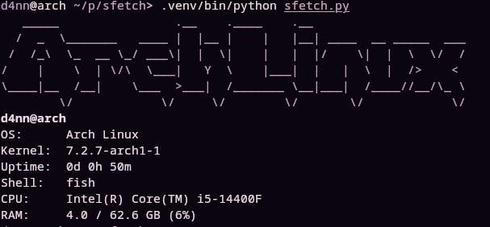
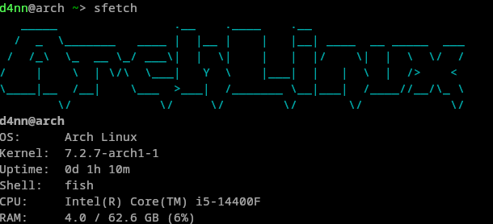
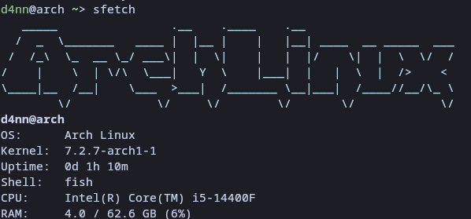
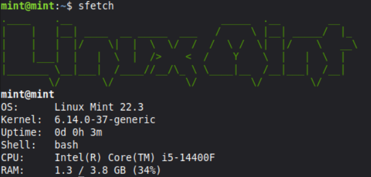

# sfetch

A minimal, customizable system info fetcher written in Python — my personal alternative to fastfetch/neofetch.





## Features

- Distro detection via `/etc/os-release`
- Kernel, uptime, shell, CPU model, RAM usage
- Per-distro ASCII art
- ANSI-colored output
- Zero config, single file, pure Python

## Supported distros
  - Arch, CachyOS, Ubuntu, Debian, Fedora, Linux Mint, RHEL, Gentoo, openSUSE, Alpine, NixOS, Artix, EndeavourOS, Void, Garuda, Manjaro, Kali, Pop!_OS Unknown distros fall back to a generic ASCII art with no color.

- Want to add yours? Add an elif distro == "your_id": branch in sfetch.py with an ASCII art, and a color entry in dcolors.

## Requirements

- Python 3.10+
- Linux (reads `/proc`, `/etc/os-release`)
- `psutil`

## Install

### Quick install (any distro)

If you already have `git` and `pipx` installed:

```bash
pipx install git+https://github.com/dkuznetsov700-ui/sfetch
```

Don't have them yet? See instructions for your distro family below.

### Arch-based (Arch, CachyOS, Manjaro, EndeavourOS)

```bash
sudo pacman -S git python-pipx
fish_add_path ~/.local/bin   # fish users
pipx ensurepath              # bash/zsh users
pipx install git+https://github.com/dkuznetsov700-ui/sfetch
```

### Debian-based (Debian, Ubuntu, Linux Mint, Pop!_OS, Kali)

```bash
sudo apt update
sudo apt install -y git pipx python3-venv
pipx ensurepath
exec $SHELL -l
pipx install git+https://github.com/dkuznetsov700-ui/sfetch
```

> **Note:** Ubuntu 20.04 ships Python 3.8 and won't work. Use 22.04+.

### Fedora

```bash
sudo dnf install -y git pipx
pipx ensurepath
exec $SHELL -l
pipx install git+https://github.com/dkuznetsov700-ui/sfetch
```

### RHEL-based (RHEL, Rocky Linux, AlmaLinux, CentOS Stream)

```bash
sudo dnf install -y git epel-release pipx gcc python3-devel
pipx ensurepath
exec $SHELL -l
pipx install git+https://github.com/dkuznetsov700-ui/sfetch
```

> **Note:** RHEL 9 ships Python 3.9. `platform.freedesktop_os_release()` requires Python 3.10+. Install Python 3.11+ first:
>
> ```bash
> sudo dnf install -y python3.11 python3.11-pip
> python3.11 -m pip install --user pipx
> python3.11 -m pipx ensurepath
> ```

### From source (for development)

```bash
git clone https://github.com/dkuznetsov700-ui/sfetch
cd sfetch
python -m venv .venv
source .venv/bin/activate
pip install -e .
sfetch
```

The `-e` flag means **editable install** — code changes are picked up immediately without reinstalling.
